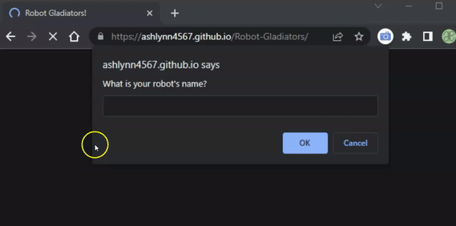
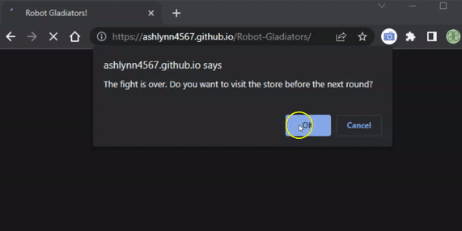
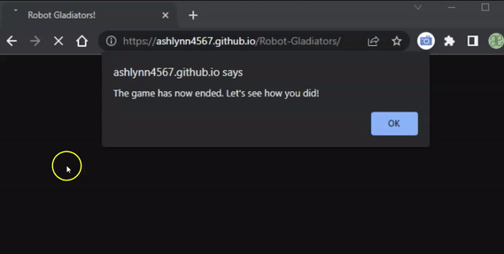
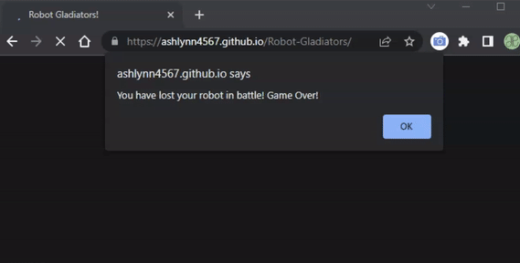

# Robot Gladiators

## Table-of-Contents

- [Description](#description)
- [Deployed Site](#deployed-site)
- [Features](#features)
- [Technologies](#technologies)
- [Future Development](#future-development)
- [Credits](#credits)

## Description

### Fight! Fight! Fight!

Do you like testing your skills and strategical decision-making? Do you like battle-royale, one takes all stakes? Do you like... robots?

Then Robot Gladiators is the game for you! Introducing our new JavaScript-coded browser game that allows you to name your own Robot Gladiator and face randomized opponents until you either die or are the last one standing. In between rounds, you have the option to stop at the shop to either top off your health or upgrade your attack. Choose your tools wisely - for each of these actions costs you precious gold. At the end of the game, you are scored on how much money you have left remaining - if your robot is still left standing.

Afterwards, the high score is recorded. Try to earn the top spot by giving it your all in the arena!

## Deployed Site

Follow [this link](https://ashlynn4567.github.io/Robot-Gladiators/) to view and use my site!

## Features

After loading into the webpage, users are presented with a prompt that asks for their robot's name. After entering a name, users are presented with the first of several rounds of robot fights. They are given the options to fight their enemy or to skip the fight. Fighting the enemy will damage the enemy. The player's enemy will recieve some damage from the enemy robot as well. If the player chooses to skip the fight, the round will immediately end.

Once the round ends, users are given the option to enter the shop. If they choose to enter the shop, they can use money to purchase a health upgrade or an attack upgrade. Each will use money they earned from the previous fight, if any. Once the user selects an option, the next round of combat begins.

Once the game ends, either by the player's robot dying or by the player completing all rounds of combat, the user is brought to the end-game screen. The prompt window will tell the user if they beat the high score or not. The window then asks the user if they wish to play the game again.

Below shows the instance that would occur if the user did not beat the high score.

Alternatively, the gif below shows the instance that would occur if the user did earn the high score record.

## Technologies

- JavaScript

## Future Development

In the future, I would like to completely revamp this project. I love the idea of coding a video game, especially one that makes the user apply strategic reasoning to earn the high score. I would like to add the following improvements:

- The alert boxes have to go. They tend to be more disruptive than anything. It would be fantastic if I could make this a full-on web game. I could add some styling to the page, and/or dynamically created robot icons. I would like to make it so that the user could see these robots moving, or "fighting" after each battle action.
- The page could refresh between "phases." For example, the fight/battle "phase" could be held on one page, while the shop is on another.

I'm always interested in refactoring code to improve it's functionality. If you would like to suggest your own improvements, you can reach me at the links below.

- <a href="mailto:ashleylynnsmith.dev@gmail.com">Email</a>
- <a href="https://github.com/ashlynn4567">GitHub</a>
- <a href="https://www.linkedin.com/in/ashley-lynn-smith/">LinkedIn</a>

## Credits

This project was built with the help of the University of Oregon's Coding Boot Camp.

## Licensing

The application is covered under the following license: [MIT](https://opensource.org/licenses/MIT)
